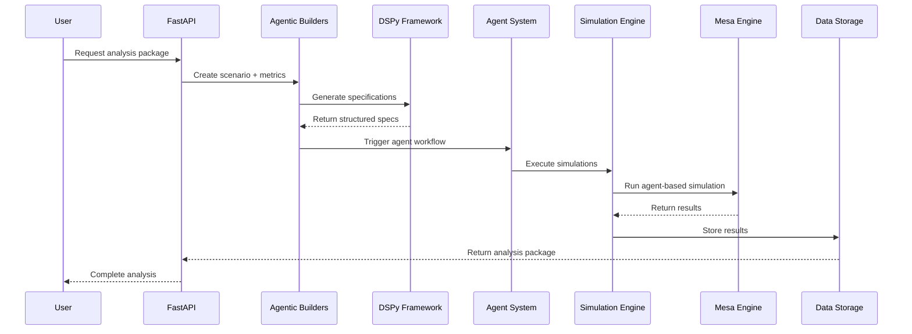

# Civilian Evacuation Simulation System Architecture

## System Overview Mermaid Diagram

```mermaid
graph TB
    %% User Interface Layer
    User[User] --> API[FastAPI Backend]
    
    %% DSPy Integration Layer
    subgraph DSPy["DSPy Framework - AI Orchestration"]
        DSPyCore[DSPy Core Engine]
        DSPySignatures[DSPy Signatures - LLM I/O Schemas]
        DSPyModules[DSPy Modules - ChainOfThought]
        DSPyReAct[DSPy ReAct Agent - Tool Integration]
        
        DSPyCore --> DSPySignatures
        DSPyCore --> DSPyModules
        DSPyCore --> DSPyReAct
    end
    
    %% Agentic Builders Layer
    subgraph AgenticBuilders["Agentic Builders"]
        AgenticMetricsBuilder[Agentic Metrics Builder]
        AgenticScenarioBuilder[Agentic Scenario Builder]
        AgenticBuilderService[Agentic Builder Service]
        
        AgenticBuilderService --> AgenticMetricsBuilder
        AgenticBuilderService --> AgenticScenarioBuilder
    end
    
    %% Traditional Builders Layer
    subgraph TraditionalBuilders["Traditional Builders"]
        ScenarioBuilder[Scenario Builder]
        MetricsBuilder[Metrics Builder Service]
        FrameworkTemplates[Framework Templates]
        
        ScenarioBuilder --> FrameworkTemplates
    end
    
    %% Agent System Layer
    subgraph AgentSystem["Agent System"]
        PlannerAgent[Planner Agent]
        WorkerAgent[Worker Agent]
        JudgeAgent[Judge Agent]
        ExplainerAgent[Explainer Agent]
        MetricsAgent[Metrics Agent]
        EmergencyPlannerAgent[Emergency Planner Agent]
        
        PlannerAgent --> WorkerAgent
        WorkerAgent --> JudgeAgent
        JudgeAgent --> ExplainerAgent
    end
    
    %% Simulation Engine Layer
    subgraph SimulationEngine["Simulation Engine"]
        EvacuationOrchestrator[Evacuation Orchestrator]
        SimulationExecutor[Simulation Executor Service]
        FrameworkSimulationService[Framework Simulation Service]
        
        subgraph MesaEngine["Mesa Agent-Based Engine"]
            MesaExecutor[Mesa Simulation Executor]
            EvacuationModel[Evacuation Model]
            EvacuationAgents[Evacuation Agents]
            NetworkCapacity[Network Capacity]
            
            MesaExecutor --> EvacuationModel
            EvacuationModel --> EvacuationAgents
            EvacuationModel --> NetworkCapacity
        end
        
        subgraph LegacyEngine["Legacy OSMnx Engine"]
            LondonSimulation[London Simulation]
            RealEvacuationSim[Real Evacuation Simulation]
            GraphService[London Graph Service]
            
            LondonSimulation --> GraphService
            RealEvacuationSim --> LondonSimulation
        end
        
        EvacuationOrchestrator --> SimulationExecutor
        SimulationExecutor --> MesaEngine
        SimulationExecutor --> LegacyEngine
        FrameworkSimulationService --> EvacuationOrchestrator
    end
    
    %% Data and Storage Layer
    subgraph DataLayer["Data & Storage"]
        StorageService[Storage Service]
        LocalS3[Local S3 Storage]
        CacheService[Cache Service]
        
        StorageService --> LocalS3
        StorageService --> CacheService
    end
    
    %% External Microservices Layer
    subgraph ExternalMicroservices["External Microservices"]
        DSPyAgentsService[DSPy Agents Service]
        RSSIngestionService[RSS Ingestion Service]
        
        DSPyAgentsService --> RSSIngestionService
    end
    
    %% External APIs Layer
    subgraph ExternalAPIs["External APIs"]
        LLMService[LLM Service - DSPy Backend]
        OpenAI[OpenAI API]
        Anthropic[Anthropic API]
        OSMnx[OSMnx/OpenStreetMap]
        
        LLMService --> OpenAI
        LLMService --> Anthropic
    end
    
    %% Main Flow Connections
    API --> AgenticBuilders
    API --> TraditionalBuilders
    API --> AgentSystem
    API --> SimulationEngine
    
    %% DSPy Integration Connections
    DSPy --> AgenticBuilders
    DSPy --> EmergencyPlannerAgent
    DSPy --> LLMService
    
    %% Agentic Builder Connections
    AgenticMetricsBuilder --> DSPySignatures
    AgenticScenarioBuilder --> DSPySignatures
    AgenticMetricsBuilder --> MetricsBuilder
    AgenticScenarioBuilder --> ScenarioBuilder
    
    %% Agent System Connections
    PlannerAgent --> ScenarioBuilder
    WorkerAgent --> SimulationEngine
    MetricsAgent --> MetricsBuilder
    EmergencyPlannerAgent --> DSPyReAct
    
    %% Simulation Engine Connections
    SimulationEngine --> DataLayer
    MesaEngine --> DataLayer
    LegacyEngine --> DataLayer
    
    %% External Service Connections
    AgenticBuilders --> LLMService
    EmergencyPlannerAgent --> LLMService
    GraphService --> OSMnx
    
    %% External Microservice Connections
    API --> ExternalMicroservices
    DSPyAgentsService --> LLMService
    RSSIngestionService --> DataLayer
    
    %% Styling
    classDef userLayer fill:#e1f5fe
    classDef dspyLayer fill:#f3e5f5
    classDef agenticLayer fill:#e8f5e8
    classDef traditionalLayer fill:#fff3e0
    classDef agentLayer fill:#fce4ec
    classDef simulationLayer fill:#e0f2f1
    classDef dataLayer fill:#f1f8e9
    classDef externalMicroservicesLayer fill:#fff8e1
    classDef externalAPIsLayer fill:#fafafa
    
    class User,API userLayer
    class DSPyCore,DSPySignatures,DSPyModules,DSPyReAct dspyLayer
    class AgenticMetricsBuilder,AgenticScenarioBuilder,AgenticBuilderService agenticLayer
    class ScenarioBuilder,MetricsBuilder,FrameworkTemplates traditionalLayer
    class PlannerAgent,WorkerAgent,JudgeAgent,ExplainerAgent,MetricsAgent,EmergencyPlannerAgent agentLayer
    class EvacuationOrchestrator,SimulationExecutor,FrameworkSimulationService,MesaExecutor,EvacuationModel,EvacuationAgents,NetworkCapacity,LondonSimulation,RealEvacuationSim,GraphService simulationLayer
    class StorageService,LocalS3,CacheService dataLayer
    class DSPyAgentsService,RSSIngestionService externalMicroservicesLayer
    class LLMService,OpenAI,Anthropic,OSMnx externalAPIsLayer
```

## Key Architecture Components

### 1. **DSPy Framework Integration**
- **DSPy Core Engine**: Manages structured LLM interactions
- **DSPy Signatures**: Define input/output schemas for LLM calls
- **DSPy Modules**: ChainOfThought and ReAct patterns
- **DSPy ReAct Agent**: Tool-enabled conversational agent

### 2. **Agentic Builders**
- **Agentic Metrics Builder**: Uses DSPy to generate YAML metrics specifications from natural language
- **Agentic Scenario Builder**: Uses DSPy to create evacuation scenarios from intent descriptions
- **Agentic Builder Service**: Orchestrates complete analysis packages (scenario + optimized metrics)

### 3. **Traditional Builders**
- **Scenario Builder**: Template-based scenario generation
- **Metrics Builder Service**: Pandas-based metrics calculation
- **Framework Templates**: Predefined scenario templates

### 4. **Agent System**
- **Planner Agent**: Generates evacuation scenarios based on user intent
- **Worker Agent**: Executes simulations in parallel with retry logic
- **Judge Agent**: Ranks scenarios based on user preferences
- **Explainer Agent**: Provides RAG-based explanations with citations
- **Metrics Agent**: Calculates and analyzes simulation metrics
- **Emergency Planner Agent**: DSPy-powered emergency response planning

### 5. **Simulation Engine**
- **Evacuation Orchestrator**: Main simulation coordinator
- **Mesa Agent-Based Engine**: Real agent-based modeling with capacity constraints
- **Legacy OSMnx Engine**: Graph-based pathfinding and visualization
- **Framework Simulation Service**: Handles framework-compliant scenarios

### 6. **Data Flow Architecture**

## Integration Points

### DSPy ↔ Agentic Builders
- Uses DSPy signatures for structured LLM interactions
- Generates YAML specifications for metrics and scenarios
- Provides reasoning and context for generated content

### Agentic Builders ↔ Traditional Builders
- Agentic builders delegate to traditional builders for execution
- Template fallback when LLM generation fails
- Framework compliance through converter services

### Agent System ↔ Simulation Engine
- Worker agents orchestrate simulation execution
- Mesa integration for realistic agent-based modeling
- Metrics agents analyze simulation results

### Simulation Engine ↔ Mesa
- Mesa provides agent-based evacuation modeling
- Network capacity constraints and realistic behavior
- Integration with existing OSMnx graph infrastructure

This architecture enables both AI-powered scenario/metrics generation and traditional template-based approaches, with a robust simulation engine that can handle both agent-based and graph-based evacuation modeling.
