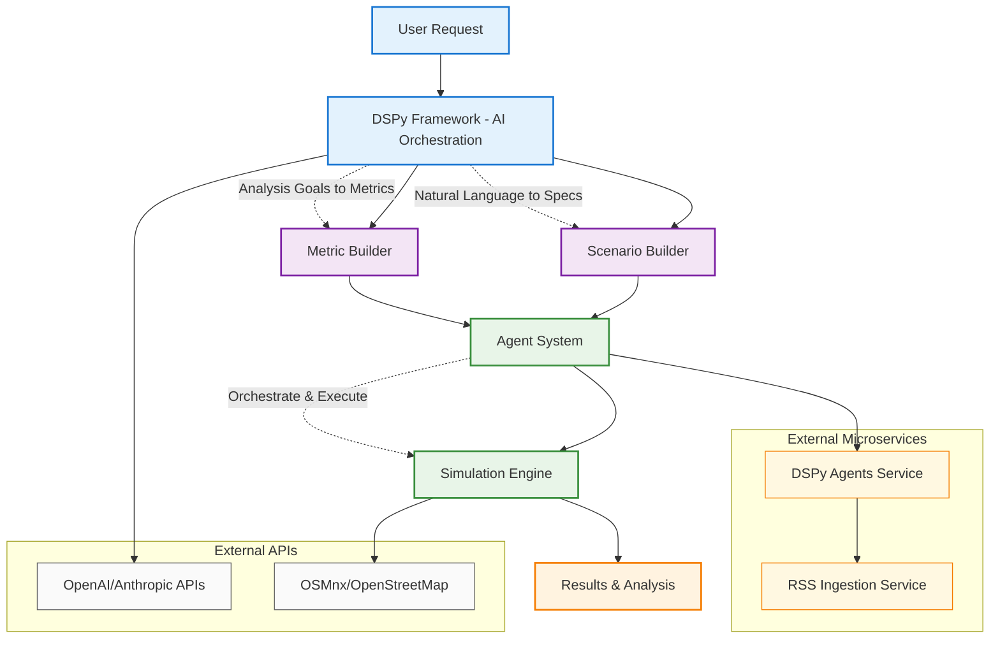

# Civilian Evacuation Simulation System Architecture

## Simplified System Overview

## How It Works

### **The Flow**
1. **User** makes a request in natural language: *"Create a flood scenario and analyze evacuation efficiency"*
2. **DSPy Framework** converts this into structured specifications using LLMs
3. **Scenario Builder** creates evacuation scenarios from the DSPy specs
4. **Metric Builder** generates analysis metrics from the DSPy specs  
5. **Agent System** orchestrates the simulation workflow (plan → execute → judge → explain)
6. **Simulation Engine** runs the actual evacuation simulations (Mesa agent-based modeling)
7. **Results** are analyzed and presented back to the user

### **Key Innovation**
- **DSPy** enables natural language → structured specifications
- **Agents** provide intelligent workflow orchestration
- **Dual engines** support both AI-generated and template-based scenarios
- **End-to-end** automation from user intent to simulation results

This simplified architecture shows how AI (DSPy) powers intelligent scenario and metrics generation, while agents orchestrate the execution through a robust simulation engine.
